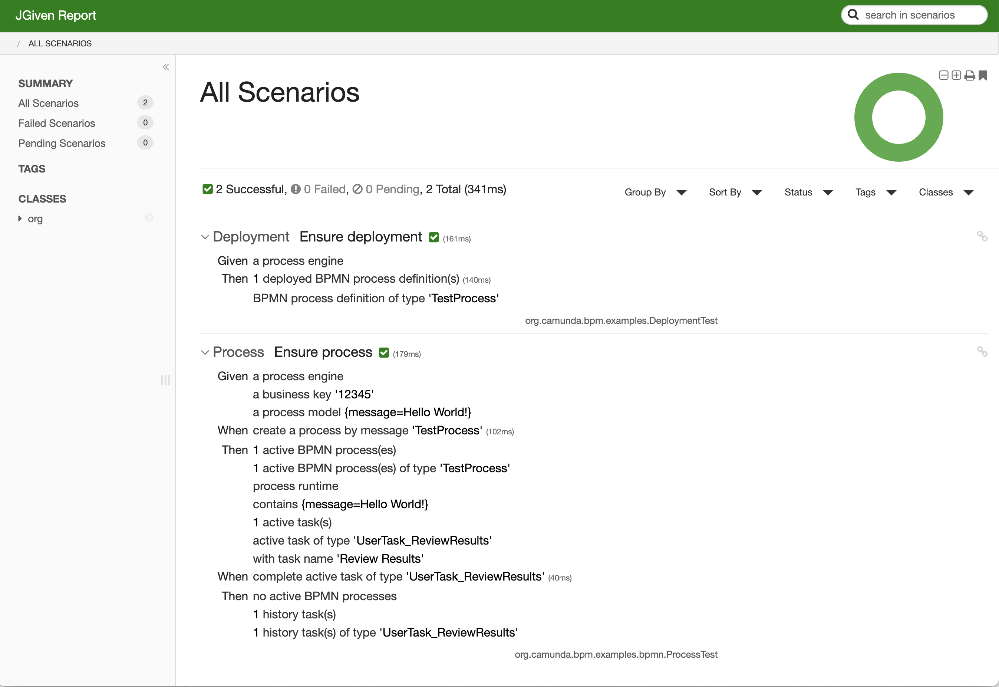

# Camunda BPM Test

A community extension for Camunda Platform 7 to write BDD-Tests using [jGiven](https://jgiven.org/) Framework.

## How to use it?
TODO

## Example Test Reports

### Deployment Test:
```
Test Class: org.camunda.bpm.examples.DeploymentTest

 Ensure deployment

   Given a process engine
    Then 1 deployed BPMN process definition(s)
         BPMN process definition of type 'TestProcess'
```

### Process Test:
```
Test Class: org.camunda.bpm.examples.bpmn.ProcessTest

 Ensure process

   Given a process engine
         a business key '12345'
         a process model {message=Hello World!}
    When create a process by message 'TestProcess'
    Then 1 active BPMN process(es)
         1 active BPMN process(es) of type 'TestProcess'
         process runtime
         contains {message=Hello World!}
         1 active task(s)
         active task of type 'UserTask_ReviewResults'
         with task name 'Review Results'
    When complete active task of type 'UserTask_ReviewResults'
    Then no active BPMN processes
         1 history task(s)
         1 history task(s) of type 'UserTask_ReviewResults'
```



### OWASP dependency check:
```
mvn dependency-check:aggregate -Pdependency-check
```

## License

[Apache License, Version 2.0](./LICENSE)

